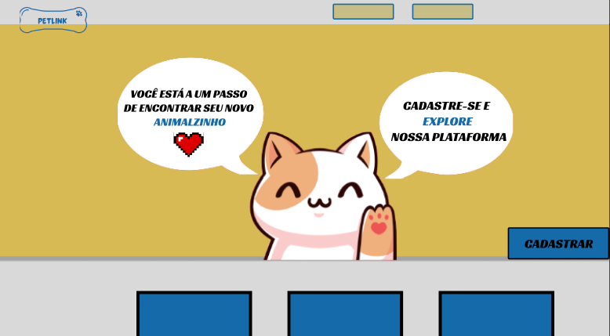

## PetLink
- Cadastro de usuário
  - Diferença de ong para pessoa física;
- Sidebar(Ong)
  - Funcionalidade de doação;
  - Cadastro de animal para doação (Ong);
- Home
  - Anuncio de animais para doação(Ong);
  - Filtro de pesquisa;
- Funcionalidade "Minha Ong" na qual a instituição consegue verificar anuncios ativos
  - Inativação de anuncio;
  - Edição de anuncio;
  - Cadastro de animal para doação;
 
 
PROTOTIPAÇÃO INICIAL ENTIDADE-ATRIBUTO DB
 

DESIGN INICIAL (PROTOTIPO)

 

 

 

 

