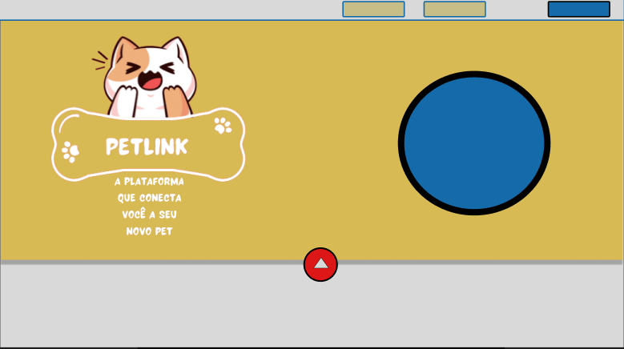
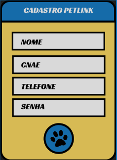
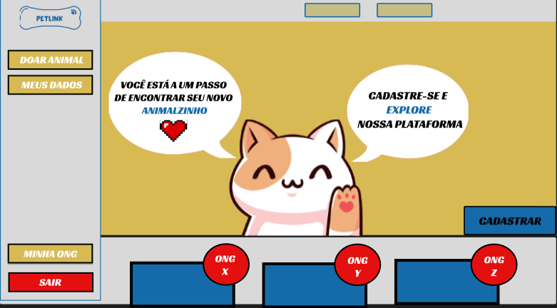
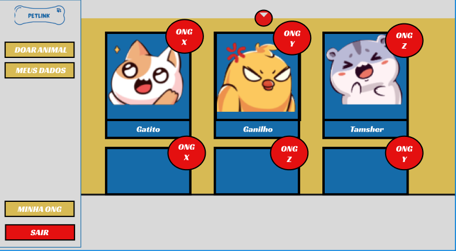

<<<<<<< HEAD
1- Cadastro de usuário
  1.1- Diferença de ong para pessoa física;
2- Sidebar(Ong)
  2.1- Funcionalidade de doação;
    2.1.1- Cadastro de animal para doação (Ong);
3- Home
  3.1- Anuncio de animais para doação(Ong);
  3.2- Filtro de pesquisa;
4- Funcionalidade "Minha Ong" na qual a instituição consegue verificar anuncios ativos
  4.1- Inativação de anuncio;
  4.2- Edição de anuncio;
  4.3- Cadastro de animal para doação
=======
## PetLink
- Cadastro de usuário
  - Diferença de ong para pessoa física;
- Sidebar(Ong)
  - Funcionalidade de doação;
  - Cadastro de animal para doação (Ong);
- Home
  - Anuncio de animais para doação(Ong);
  - Filtro de pesquisa;
- Funcionalidade "Minha Ong" na qual a instituição consegue verificar anuncios ativos
  - Inativação de anuncio;
  - Edição de anuncio;
  - Cadastro de animal para doação;
 
 
PROTOTIPAÇÃO INICIAL ENTIDADE-ATRIBUTO DB
 

DESIGN INICIAL (PROTOTIPO)
 

 

 

 

 

>>>>>>> 7a56f0eeb666110927ecd49330b8c5ae5fe5919d
